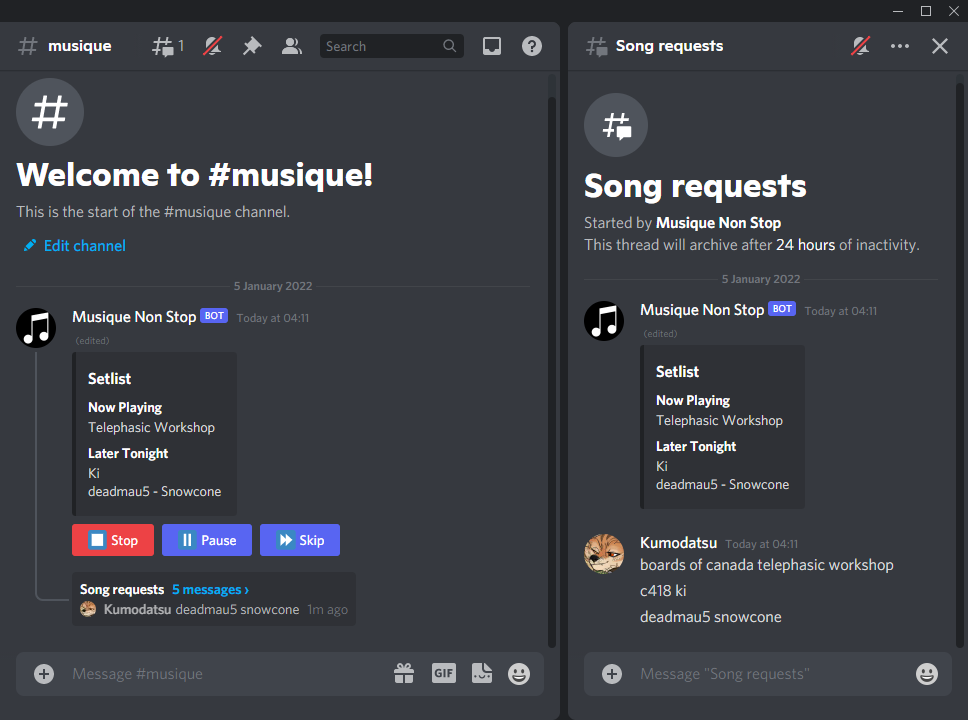
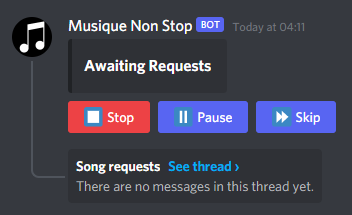

# Musique Non Stop
This is yet another Discord music bot. This one uses a different kind of
interface than the usual slash commands, relying instead on buttons and threads
to create a (hopefully) more fluent and intuitive interface.



## Getting started
All paths and commands presented in this section are relative to the
repository's root folder (that is, the folder that contains this README file)
unless otherwise specified.

### Prerequisites
To run this project you need the following:
- To build the source code, you need [.NET SDK version 6.0.0][1] or greater. If
you don't want to build the code yourself (or don't know what that means), you
can also simply [download the program][5].
- You need a Discord bot token. If you don't have one yet, [create a new
Discord application][2] and add a bot to it.
- For the bot to play any audio, you need to run a [Lavalink][3] server.
Lavalink itself requires Java. See its documentation on how to set up
(especially the "Server configuration" section in its README).
- You need to make a configuration file as described in the following section.

### Configuration
The bot requires a configuration with certain information to exist. The
configuration file must be a [YAML][4] file containing the following key:

Key            | Description
---------------|-------------
token          | Your bot's token.

Example of a configuration file:

```yml
token: your token here
```

If you run the program when no such file exists, it will be automatically
generated for you; you'll then only have to open it and put your token in.

### Building
Skip this part if you downloaded the program.

Run the following command from the `MusiqueNonStop` folder:

    dotnet build -c <CONFIGURATION>

where `<CONFIGURATION>` is one of `Debug`, `Release` depending on which
configuration you want to build.

### Running
To use the bot's audio functionality you must have a Lavalink server set up and
running (see the [prerequisites](#prerequisites)). Once this is done, run the
following command from the `MusiqueNonStop` folder:

    dotnet run -c <CONFIGURATION> -- <ARGS>

where `<CONFIGURATION>` is one of `Debug`, `Release` depending on which
configuration you want to run; and `<ARGS>` are the command line arguments for
the program. The supported commands are:

Command     | Description
------------|------------
`-c <PATH>` | The path to your config file. Defaults to `config.yml`.
`--help`    | Displays a list of all command line arguments.
`--version` | Displays information about the program's version.

## Adding the bot to a server
Find your bot's Application ID. You can find this in your application's page
under the tab "General Information". In the following link, replace
`<APPLICATION_ID>` with your Application ID:

    https://discord.com/api/oauth2/authorize?client_id=<APPLICATION_ID>&permissions=377960270912&scope=applications.commands%20bot

Then open the resulting link in your web browser. This allows you to add the bot
to a server on which you have the appropriate permissions, giving the bot the
minimal permissions it needs to function. The bot uses the following
permissions:

- Read Messages/View Channels
- Send Messages
- Create Public Threads
- Create Private Threads
- Send Messages in Threads
- Add Reactions
- Connect
- Speak

## Usage
Commands must be sent in a text channel that the bot can read.

Command  | Description
---------|------------
`/join`  | Makes the bot join your voice channel.
`/leave` | Makes the bot leave its voice channel.

To begin, enter a voice channel and use the `/join` command to make the bot join
that channel. The bot will create a special message in the text channel in which
the `/join` command was executed, which can be interacted with to play songs
(see the image below). It is recommended to execute the command in a dedicated
channel so the message doesn't get buried by other messages.



To request songs, send search queries or YouTube links in the created "Song
requests" thread. Search results will be placed into the queue. If the queue is
empty, the first search result will automatically be played.


Use the "Stop", "Pause" and "Skip" buttons to interact with the music player.
Discord's UI allows you to have the channel with the player side by side with
the song requests thread, allowing access to both the buttons and the song
requests.

[1]: <https://dotnet.microsoft.com/download/dotnet/6.0>
[2]: <https://discord.com/developers/applications>
[3]: <https://github.com/freyacodes/Lavalink>
[4]: <https://yaml.org/>
[5]: <https://github.com/Kumodatsu/musique-non-stop/releases/latest>
